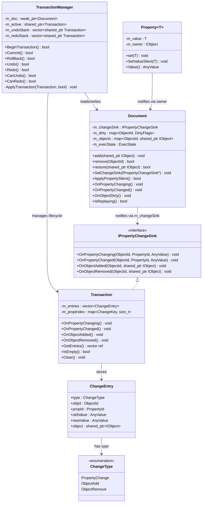
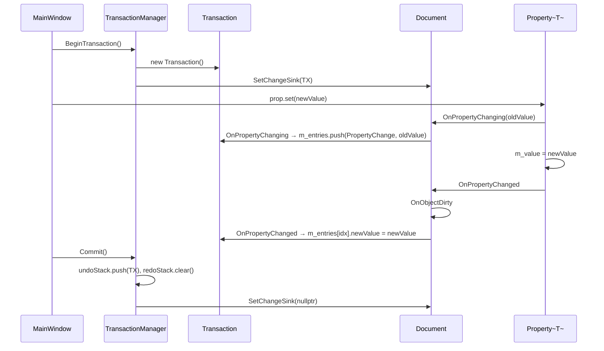
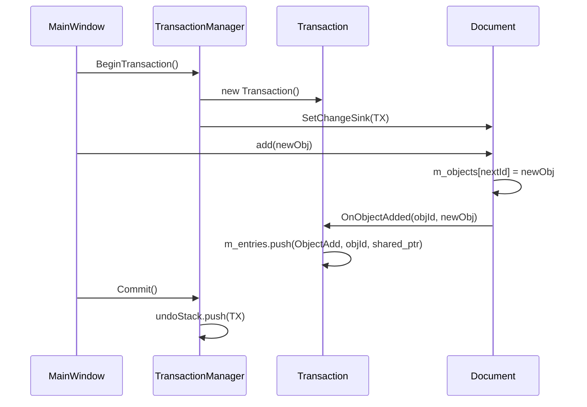
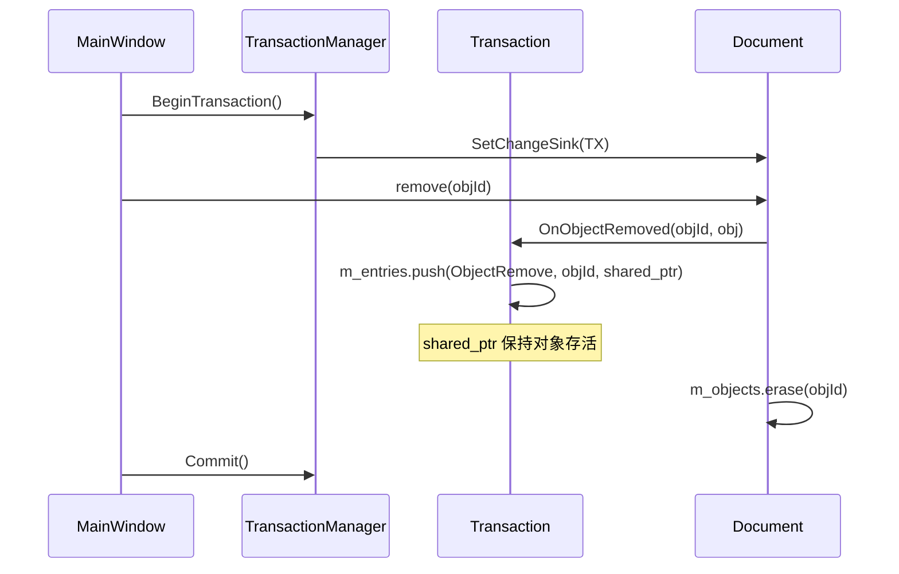
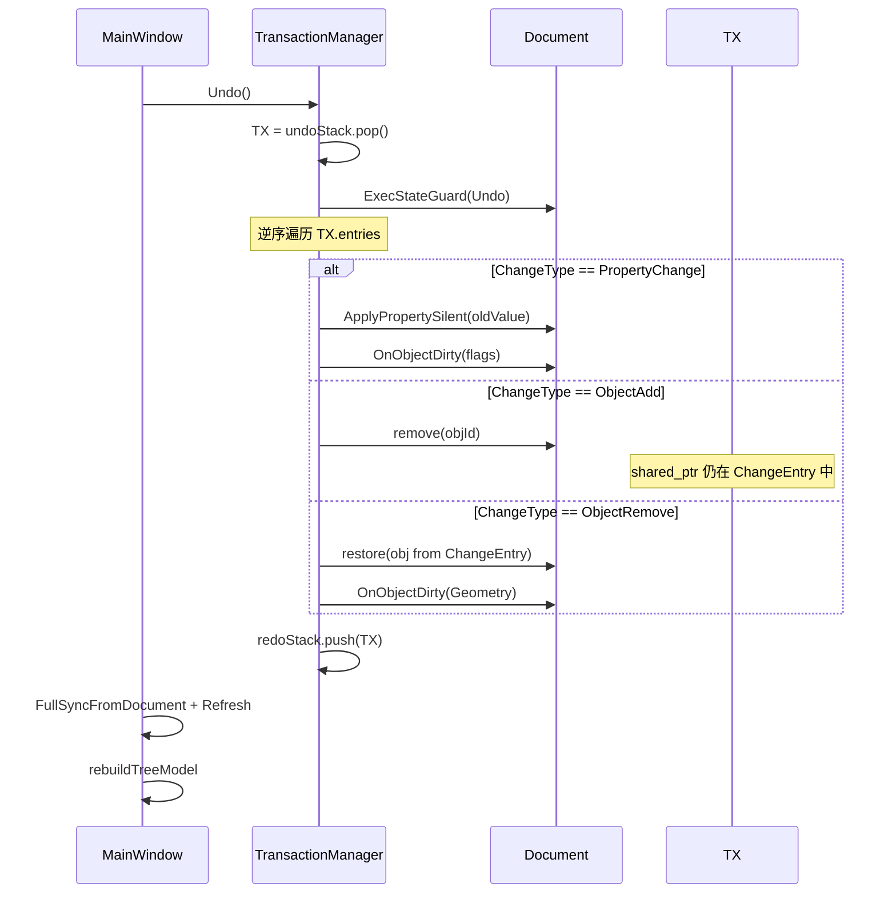
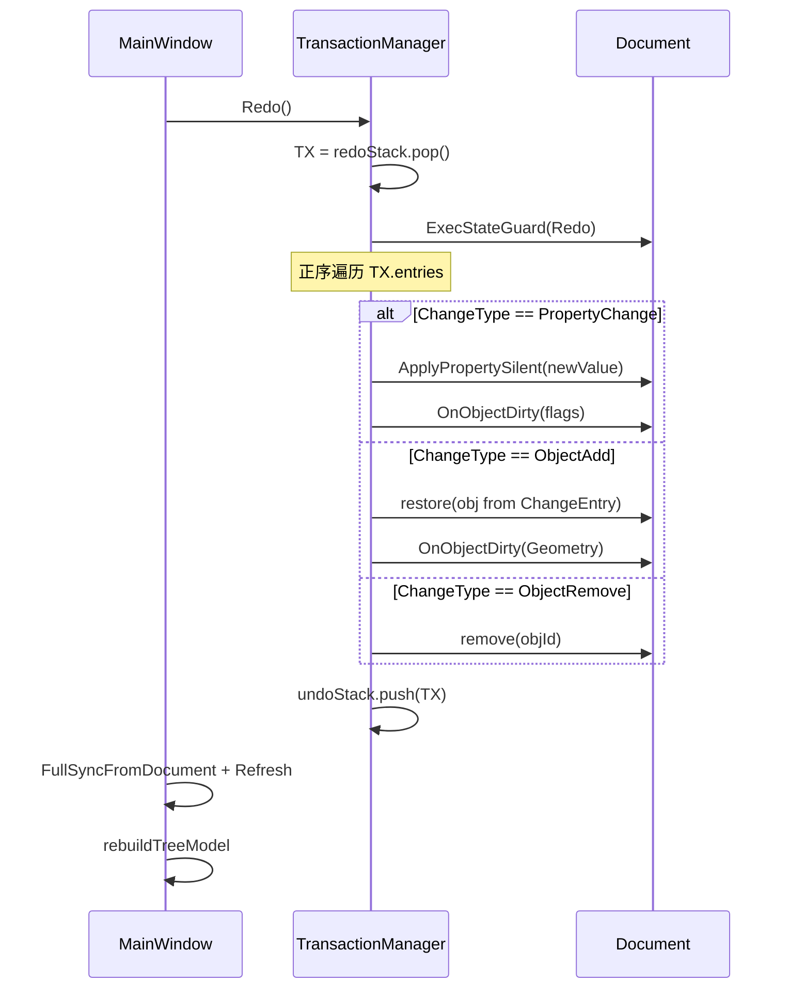
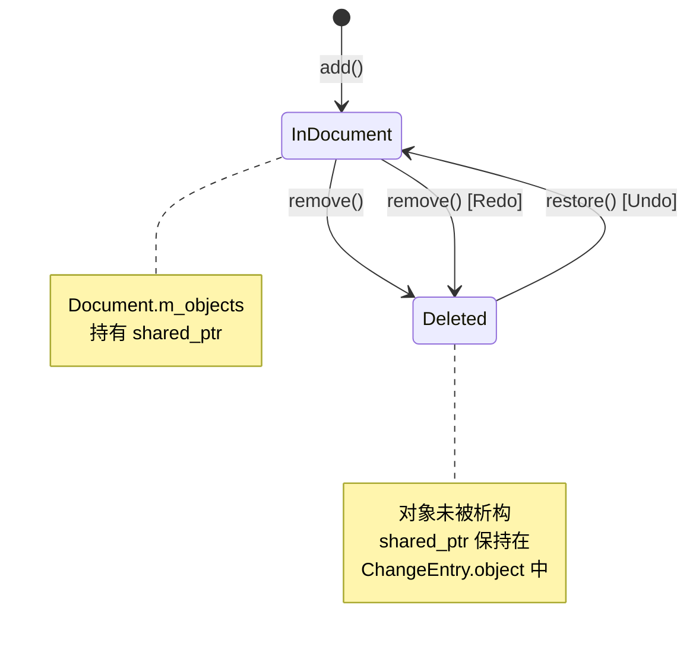

# CAD-Project-utils 事务系统技术文档

> 版本：2.0  
> 日期：2026-04-18  
> 模块：Platform / Data / Application

---

## 目录

1. [概述](#1-概述)
2. [架构总览](#2-架构总览)
3. [核心类设计](#3-核心类设计)
4. [类图](#4-类图)
5. [数据结构](#5-数据结构)
6. [流程详解](#6-流程详解)
7. [AnyValue 类型擦除机制](#7-anyvalue-类型擦除机制)
8. [DirtyFlags 与渲染同步](#8-dirtyflags-与渲染同步)
9. [属性宏注册系统与事务的关系](#9-属性宏注册系统与事务的关系)
10. [文件清单](#10-文件清单)

---

## 1. 概述

事务系统是 CAD-Project-utils 的核心基础设施之一，负责：

- **变更记录**：捕获对象属性的每一次修改（oldValue → newValue）
- **对象增删记录**：捕获对象的创建和删除操作
- **Undo/Redo**：支持多步撤销和重做，覆盖属性修改、对象创建、对象删除三种操作
- **渲染同步**：Undo/Redo 后自动补写 DirtyFlags，驱动渲染管线更新

设计遵循以下原则：

- **单一职责**：Transaction 只记录数据，TransactionManager 只管理栈和执行回放，Document 只负责数据容器和通知转发
- **依赖方向清晰**：Platform 层 → Data 层（单向依赖），Document 通过 IPropertyChangeSink 接口与事务交互
- **对象生命周期安全**：删除的对象通过 shared_ptr 保持在 ChangeEntry 中，Undo 时直接恢复，无需重新创建
- **最小侵入**：属性变更通过 Property<T> 的 set() 自动触发通知链，业务代码无需手动记录变更

---

## 2. 架构总览

### 模块分层

```
┌─────────────────────────────────────────────────┐
│                  Application 层                   │
│  MainWindow  持有 TransactionManager              │
│  用户操作 → BeginTransaction → 修改 → Commit      │
│  Undo/Redo → TransactionManager → 渲染刷新        │
│  Add Sphere / Delete → 事务包裹                   │
├─────────────────────────────────────────────────┤
│                  Platform 层                      │
│  TransactionManager  事务栈管理 + Undo/Redo 执行   │
│  Transaction         纯数据记录类                  │
├─────────────────────────────────────────────────┤
│                    Data 层                        │
│  Document            数据容器 + 脏标记 + 通知转发   │
│  Object / Property   属性变更 → 通知链             │
│  IPropertyChangeSink 变更通知接口（含对象增删）     │
├─────────────────────────────────────────────────┤
│                   Common 层                       │
│  AnyValue / NameDefine / Point3d                  │
└─────────────────────────────────────────────────┘
```

### 支持的操作类型

| 操作类型 | 记录方式 | Undo 行为 | Redo 行为 |
|----------|----------|-----------|-----------|
| 属性修改 | ChangeEntry(PropertyChange) 记录 oldValue/newValue | ApplyPropertySilent(oldValue) | ApplyPropertySilent(newValue) |
| 对象创建 | ChangeEntry(ObjectAdd) 持有 shared_ptr | Document.remove(objId) | Document.restore(obj) |
| 对象删除 | ChangeEntry(ObjectRemove) 持有 shared_ptr | Document.restore(obj) | Document.remove(objId) |

---

## 3. 核心类设计

### 3.1 IPropertyChangeSink（接口）

**位置**：`src/Data/Public/IPropertyChangeSink.h`

纯虚接口，定义属性变更和对象增删的通知协议：

```cpp
class IPropertyChangeSink {
public:
    virtual ~IPropertyChangeSink() noexcept = default;
    
    // Property-level
    virtual void OnPropertyChanging(ObjectId, PropertyId, const AnyValue& oldValue) = 0;
    virtual void OnPropertyChanged(ObjectId, PropertyId, const AnyValue& newValue) = 0;
    
    // Object-level
    virtual void OnObjectAdded(ObjectId, const shared_ptr<IObject>& obj) = 0;
    virtual void OnObjectRemoved(ObjectId, const shared_ptr<IObject>& obj) = 0;
};
```

### 3.2 Transaction（纯数据记录类）

**位置**：`src/Platform/Public/Transaction.h`、`src/Platform/Private/Transaction.cpp`

实现 `IPropertyChangeSink` 接口，在一次事务中记录所有变更：

```cpp
class Transaction : public IPropertyChangeSink {
public:
    void OnPropertyChanging(...) override;   // 记录 oldValue
    void OnPropertyChanged(...) override;    // 记录 newValue
    void OnObjectAdded(...) override;        // 记录对象创建
    void OnObjectRemoved(...) override;      // 记录对象删除（持有 shared_ptr）
    
    const vector<ChangeEntry>& GetEntries() const noexcept;
    bool IsEmpty() const noexcept;
    void Clear();

private:
    vector<ChangeEntry> m_entries;
    unordered_map<ChangeKey, size_t, ChangeKeyHash> m_propIndex;
};
```

**关键设计**：
- 内部使用 `vector<ChangeEntry>` 保持操作的顺序（Undo 时需要逆序回放）
- `m_propIndex` 用于属性变更的去重（同一属性只记录第一次 oldValue）
- 对象删除时，`ChangeEntry.object` 持有 `shared_ptr<IObject>`，保证对象不被析构

### 3.3 TransactionManager（事务栈管理器）

**位置**：`src/Platform/Public/TransactionManager.h`、`src/Platform/Private/TransactionManager.cpp`

```cpp
class TransactionManager {
public:
    explicit TransactionManager(weak_ptr<Document> doc);
    
    bool BeginTransaction();
    bool Commit();
    bool RollBack();
    bool Undo();
    bool Redo();
    bool CanUndo() const noexcept;
    bool CanRedo() const noexcept;

private:
    void ApplyTransaction(const Transaction& tx, bool useOldValues);
    
    weak_ptr<Document> m_doc;
    shared_ptr<Transaction> m_active;
    vector<shared_ptr<Transaction>> m_undoStack;
    vector<shared_ptr<Transaction>> m_redoStack;
};
```

**ApplyTransaction 的三种操作处理**：

| useOldValues | PropertyChange | ObjectAdd | ObjectRemove |
|-------------|----------------|-----------|--------------|
| true (Undo) | ApplyPropertySilent(oldValue) | remove(objId) | restore(obj) |
| false (Redo) | ApplyPropertySilent(newValue) | restore(obj) | remove(objId) |

- Undo 时逆序遍历 entries（先撤销后发生的操作）
- Redo 时正序遍历 entries

### 3.4 Document（数据容器 + 通知转发）

**位置**：`src/Data/Public/Document.h`、`src/Data/Private/Document.cpp`

```cpp
class Document : public IDirtySink {
public:
    // Object management
    void add(const shared_ptr<IObject>& obj);      // 添加对象 + 通知 changeSink
    bool remove(ObjectId id);                       // 移除对象 + 通知 changeSink
    bool restore(const shared_ptr<IObject>& obj);   // 恢复对象（Undo 专用，不通知）
    
    // Change sink
    void SetChangeSink(IPropertyChangeSink* sink);
    
    // Silent property write (for Undo/Redo replay)
    bool ApplyPropertySilent(ObjectId, PropertyId, const AnyValue&);
    
    // ExecState (public for TransactionManager)
    enum class ExecState { Normal, Undo, Redo };
    class ExecStateGuard { ... };
};
```

**对象生命周期管理**：

```
正常状态：Document.m_objects 持有 shared_ptr → 引用计数 ≥ 1
    ↓ remove()
删除后：Document.m_objects 中移除，但 ChangeEntry.object 持有 shared_ptr → 引用计数 ≥ 1
    ↓ Undo → restore()
恢复后：Document.m_objects 重新持有 shared_ptr → 引用计数 ≥ 2
    ↓ redo stack 被清空
最终：只有 Document.m_objects 持有 → 引用计数 = 1
```

对象永远不会被意外析构，因为至少有一个 shared_ptr 持有它。

### 3.5 Property<T>（属性模板类）

**位置**：`src/Data/Public/Property.h`

```cpp
template<class T>
class Property : public PropertyBase {
public:
    void set(T nv) {
        if (nv == m_value) return;
        NotifyChanging();       // → Transaction 记录 oldValue
        m_value = std::move(nv);
        NotifyChanged();        // → dirty + Transaction 记录 newValue
    }
    
    void SetValueSilent(T nv) { m_value = std::move(nv); }
    
    AnyValue Value() const override {
        if constexpr (AnyValueSupported<T>::value)
            return AnyValue(m_value);
        else
            return AnyValue();
    }
};
```

---

## 4. 类图



---

## 5. 数据结构

### 5.1 ChangeType

```cpp
enum class ChangeType : uint8_t {
    PropertyChange,   // 属性修改
    ObjectAdd,        // 对象创建
    ObjectRemove      // 对象删除
};
```

### 5.2 ChangeEntry

```cpp
struct ChangeEntry {
    ChangeType type;
    ObjectId objId;
    
    // PropertyChange 专用
    PropertyId propId;
    AnyValue oldValue;
    AnyValue newValue;
    
    // ObjectAdd / ObjectRemove 专用
    shared_ptr<IObject> object;  // 持有对象的 shared_ptr，保证生命周期
};
```

### 5.3 ChangeKey / ChangeRec（兼容旧结构）

```cpp
struct ChangeKey {
    ObjectId objId;
    PropertyId propId;
};

struct ChangeRec {
    AnyValue oldValue;
    AnyValue newValue;
};
```

### 5.4 AnyValue

基于 `std::string` 的类型擦除值容器：

| 支持类型 | 序列化格式 |
|----------|-----------|
| `int`, `uint`, `long`, `long long` 等整型 | `std::to_string` |
| `float`, `double` | `std::to_string` |
| `bool` | `"true"` / `"false"` / `"1"` / `"0"` |
| `std::string` | 原样存储 |
| `Point3d` | `"x,y,z"` 格式 |
| `shared_ptr<IBody>` 等 | ❌ 不支持，返回空 AnyValue |

---

## 6. 流程详解

### 6.1 属性编辑流程



### 6.2 对象创建流程



### 6.3 对象删除流程



### 6.4 Undo 流程（含对象增删）



### 6.5 Redo 流程



### 6.6 对象生命周期示意



---

## 7. AnyValue 类型擦除机制

AnyValue 是事务系统的值传输载体。它将所有支持的类型统一序列化为 `std::string`。

### 类型注册

```cpp
template<typename T>
struct AnyValueSupported : std::false_type {};

template<> struct AnyValueSupported<double> : std::true_type {};
template<> struct AnyValueSupported<Point3d> : std::true_type {};
// ...
```

### Property::Value() 的条件编译

```cpp
AnyValue Value() const override {
    if constexpr (AnyValueSupported<T>::value)
        return AnyValue(m_value);
    else
        return AnyValue();  // 不参与 Undo
}
```

### Point3d 的序列化

```cpp
inline AnyValue::AnyValue(const Point3d& pt) : text(pt.ToString()) {}
// "0,0,0" 格式

template<> inline Point3d AnyValue::Get<Point3d>() const {
    return Point3d::FromString(text);
}
```

---

## 8. DirtyFlags 与渲染同步

### DirtyFlags 定义

```cpp
enum class DirtyFlags : uint8_t {
    None      = 0,
    Visual    = 1 << 0,
    Transform = 1 << 1,
    Geometry  = 1 << 2,
};
```

### 正常编辑时

```
Property::set() → Document::OnPropertyChanged() → OnObjectDirty(flags)
```

### Undo/Redo 时

TransactionManager 在 ApplyTransaction 中手动补写：
- PropertyChange：通过 TypeMeta 查找属性的 DirtyFlags
- ObjectRemove 的 Undo（restore）：补写 DirtyFlags::Geometry
- ObjectAdd 的 Redo（restore）：补写 DirtyFlags::Geometry

### 渲染同步策略

| 场景 | 同步方法 | 说明 |
|------|----------|------|
| 属性编辑 | SyncFromDocument(false) | 增量：只处理 dirty 对象 |
| Undo/Redo | FullSyncFromDocument | 全量：对比 Document 和 GraphicsScene，处理增删改 |
| 初始加载 | SyncFromDocument(true) | 全量：构建所有对象 |

`FullSyncFromDocument` 的逻辑：
1. 收集 Document 中所有对象 ID
2. 遍历 GraphicsScene，移除不在 Document 中的节点
3. 遍历 Document，为每个对象 GetOrCreate 节点并重建几何

---

## 9. 属性宏注册系统与事务的关系

### 宏展开

```cpp
CAD_PROP(double, radius, DirtyFlags::Geometry)
```

生成：
1. `Property<double> m_radius`
2. `_cad_bind_radius()` → Bind
3. `_cad_apply_radius()` → SetValueSilent
4. 静态 Registrar 注册到 PropertyRegistry

### 事务回放路径

```
TransactionManager::Undo()
  → Document::ApplyPropertySilent(objId, propId, oldValue)
    → TypeMeta::FindById(propId) → PropertyDescriptor
      → desc->applyAny(obj, oldValue)
        → _cad_apply_radius(obj, v)
          → p->m_radius.SetValueSilent(v.Get<double>())
```

完全绕过 Property::set() 的通知链，避免回放期间递归记录。

---

## 10. 文件清单

| 文件路径 | 职责 |
|----------|------|
| `src/Platform/Public/TransactionManager.h` | TransactionManager 声明 |
| `src/Platform/Private/TransactionManager.cpp` | TransactionManager 实现（含三种操作的 Undo/Redo） |
| `src/Platform/Public/Transaction.h` | Transaction 声明（vector<ChangeEntry> 存储） |
| `src/Platform/Private/Transaction.cpp` | Transaction 实现 |
| `src/Platform/Public/ChangeKey.h` | ChangeKey / ChangeRec / ChangeType / ChangeEntry 定义 |
| `src/Platform/Public/PlatformExport.h` | DLL 导出宏 |
| `src/Data/Public/Document.h` | Document 声明（含 add/remove/restore） |
| `src/Data/Private/Document.cpp` | Document 实现 |
| `src/Data/Public/IPropertyChangeSink.h` | 变更通知接口（含 OnObjectAdded/Removed） |
| `src/Data/Public/Property.h` | Property<T> 模板 |
| `src/Data/Public/PropertyDescriptor.h` | PropertyDescriptor |
| `src/Data/Public/TypeMeta.h` | TypeMeta |
| `src/Data/Public/PropertyRegistry.h` | 属性宏注册系统 |
| `src/Data/Public/DirtyFlags.h` | DirtyFlags 枚举 |
| `src/Common/Public/NameDefine.h` | AnyValue / AnyValueSupported |
| `src/Common/Public/Point3d.h` | Point3d（含 AnyValue 互转） |
| `src/Application/UI/MainWindow.h` | MainWindow 声明 |
| `src/Application/UI/MainWindow.cpp` | MainWindow 实现（事务包裹、Undo/Redo/Add/Delete UI） |
| `src/Application/App/RenderSystem.h` | RenderSystem 声明（含 FullSyncFromDocument） |
| `src/Application/App/RenderSystem.cpp` | RenderSystem 实现 |
| `src/Application/Scene/GraphicsScene.h` | GraphicsScene（含 Remove） |