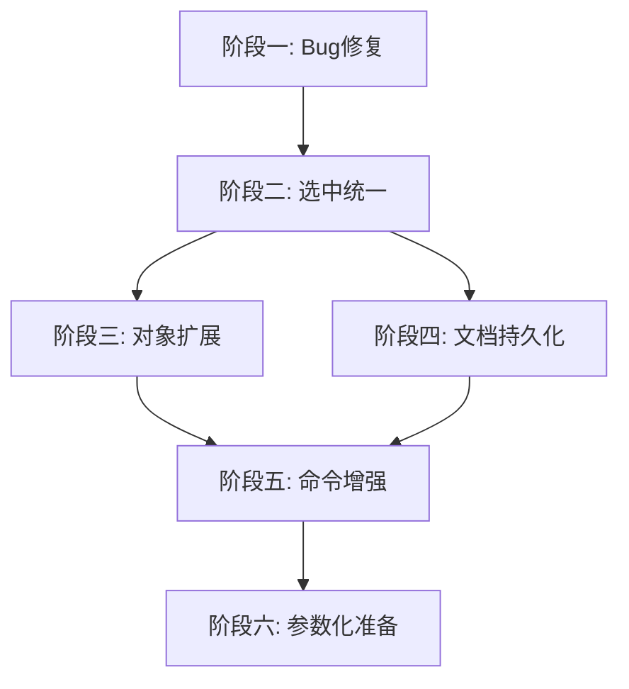

# CAD-Project-utils 后续开发方案

## 当前状态总结

### 已完成
- Document/Object/Property 数据模型 + 编译期宏注册系统
- Transaction + TransactionManager 事务系统（属性变更 + 对象增删 Undo/Redo）
- ICommand + CommandRegistry + REGISTER_COMMAND 命令系统
- XML 驱动 UI 构建（CommandUIBuilder）
- OpenCASCADE 几何造型层（SphereObject）
- OSG + Qt 渲染层（嵌入 QOpenGLWidget，拾取选中）
- 增量/全量刷新管线（RenderSystem → GraphicsScene → RenderView）

### 已知 Bug
1. **点击球体后球体消失** — `RenderView::refresh()` 的清理逻辑在增量模式下误删节点
2. `MainWindow::m_viewport` 声明未使用（残留代码）

---

## 开发阶段

### 阶段一：Bug 修复与渲染稳定性

**1.1 修复 RenderView::refresh() 增量/全量语义**

问题根因：`refresh()` 接收一个 `unordered_map<ObjectId, shared_ptr<IGraphicsNode>>`，当前逻辑会把"不在传入 map 中的 container"全部删除。但增量刷新（`Refresh(false)`）只传入 dirty 子集，导致非 dirty 节点被误删。

方案：将 `refresh()` 拆分为两个语义明确的方法：

```
refreshAll(fullMap)    — 全量：同步所有节点，删除多余的
refreshDirty(dirtyMap) — 增量：只更新传入的节点，不删除任何现有节点
```

涉及文件：
- `src/Render/Public/IRenderView.h` — 接口增加 `refreshDirty()`
- `src/Render/Private/RenderView.h` / `RenderView.cpp` — 实现两个方法
- `src/Application/App/RenderSystem.cpp` — `Refresh(true)` 调 `refreshAll()`，`Refresh(false)` 调 `refreshDirty()`

**1.2 清理残留代码**

- 删除 `MainWindow::m_viewport` 成员声明

---

### 阶段二：选中状态统一

**2.1 3D 视图 → 树视图联动**

当前点击 3D 球体后只更新了属性面板，树视图没有同步高亮。

方案：
- `MainWindow` 的 pick 回调中增加树视图选中同步
- 新增 `MainWindow::SelectInTree(ObjectId)` 方法，遍历 `m_docTreeModel` 找到对应 item 并设置 selection

**2.2 树视图 → 3D 视图联动**

当前 `onTreeSelectionChanged` 只调了 `buildPropertyModel()`（且该方法几乎是空的）。

方案：
- `onTreeSelectionChanged` 中提取 ObjectId，调用 `m_renderSystem->GetRenderView()->SetSelected(id)` 和 `UpdateProperties(id)`
- 需要在树节点上存储 `Role_ObjectId`（当前只存了 `Role_ObjectPtr`）

**2.3 点击空白取消选中**

当前 `OsgQtWidget::mousePressEvent` 中 pick 到空白返回 `ObjectId(-1)`，`RenderView` 构造函数中的回调过滤了 `id == 0` 但没过滤 `-1`。

方案：统一使用 `0` 表示"无选中"，`Pick()` 返回 `0` 而非 `-1`。

---

### 阶段三：对象类型扩展

**3.1 BoxObject**

新增长方体对象，属性：`center(Point3d)`, `length(double)`, `width(double)`, `height(double)`。

涉及文件：
- `src/Data/Private/BoxObject.h` / `BoxObject.cpp` — 继承 Object，使用 CAD_PROP 宏
- `src/Data/Public/ObjectFactory.h` / `ObjectFactory.cpp` — 增加 `CreateBoxObject()`
- `src/Geometry/Private/GeoBuildUtils.cpp` — 增加 `BRepPrimAPI_MakeBox` 调用

**3.2 CylinderObject**

新增圆柱体对象，属性：`center(Point3d)`, `radius(double)`, `height(double)`。

涉及文件：同上模式。

**3.3 对应命令**

- `AddBoxCommand` / `AddCylinderCommand`
- 更新 `config/ui_layout.xml` 增加菜单项

**3.4 ObjectFactory 通用化（可选）**

当前 ObjectFactory 是硬编码的静态方法。可考虑引入注册机制：

```cpp
using ObjectCreator = std::function<shared_ptr<IObject>(const string& name, const json& params)>;
ObjectFactory::Register("Sphere", creator);
ObjectFactory::Create("Sphere", name, params);
```

---

### 阶段四：文档持久化

**4.1 序列化框架**

方案：使用已引入的 nlohmann_json 库。

序列化结构：
```json
{
  "name": "Document",
  "objects": [
    {
      "type": "SphereObject",
      "id": 1,
      "properties": {
        "objName": "Sphere_1",
        "center": "0,0,0",
        "radius": "50"
      }
    }
  ]
}
```

**4.2 IObject 序列化接口**

利用现有的 TypeMeta + PropertyDescriptor 系统，可以实现通用序列化：
- 遍历 `TypeMeta::descriptors`，对每个属性调用 `prop.Value()` 获取 AnyValue
- 反序列化时通过 `applyAny` 写回

涉及文件：
- `src/Data/Public/ISerializer.h` — 序列化接口
- `src/Data/Private/JsonSerializer.cpp` — JSON 实现
- `src/Data/Public/Document.h` — 增加 `Save(path)` / `Load(path)`

**4.3 Save/Load 命令**

- `SaveCommand` / `LoadCommand`（或 `SaveAsCommand`）
- 更新 `config/ui_layout.xml` 增加 File 菜单

---

### 阶段五：命令系统增强

**5.1 命令 Enabled 状态实时刷新**

当前 QAction 的 enabled 状态只在点击时检查 `CanExecute()`。应该在选中状态变化、文档变化时刷新所有 QAction。

方案：
- `CommandUIBuilder` 返回 `QAction*` 列表或注册到一个 `ActionManager`
- 在关键时机（选中变化、命令执行后）调用 `ActionManager::RefreshAll()`
- 每个 QAction 绑定的 lambda 中调用对应 command 的 `CanExecute()` 更新 enabled

**5.2 命令元数据扩展**

ICommand 增加可选的元数据方法：
```cpp
virtual std::string GetIcon() const { return ""; }
virtual std::string GetTooltip() const { return GetName(); }
virtual std::string GetShortcut() const { return ""; }
```

这样 XML 中的 shortcut 可以作为 fallback，命令自身也能声明默认快捷键。

---

### 阶段六：参数化建模准备

**6.1 约束/依赖系统设计**

为未来的参数化建模做准备，设计属性间的依赖关系：
- 属性 A 变化时自动触发属性 B 重算
- 需要拓扑排序避免循环依赖

这是一个较大的架构变更，建议先做设计文档再实现。

---

## 推荐执行顺序



阶段一和二是基础稳定性工作，应该优先完成。阶段三和四可以并行推进。阶段五依赖三四的完成度。阶段六是长期规划。

---

## 各阶段涉及的模块变更概览

| 阶段 | Common | Data | Platform | Geometry | Render | Application |
|------|--------|------|----------|----------|--------|-------------|
| 一 | - | - | - | - | 修改 | 修改 |
| 二 | - | - | - | - | 修改 | 修改 |
| 三 | - | 新增 | - | 修改 | - | 新增+修改 |
| 四 | - | 新增+修改 | - | - | - | 新增+修改 |
| 五 | - | - | 修改 | - | - | 新增+修改 |
| 六 | - | 新增 | 可能修改 | - | - | - |