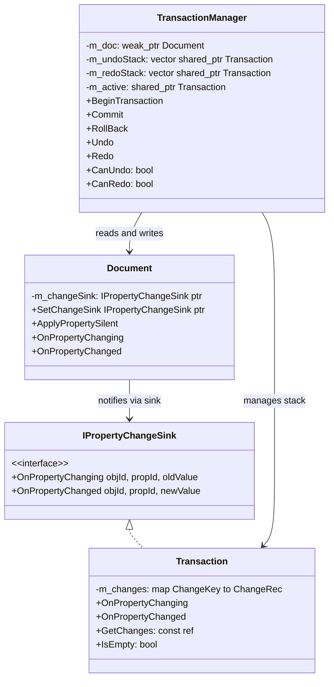
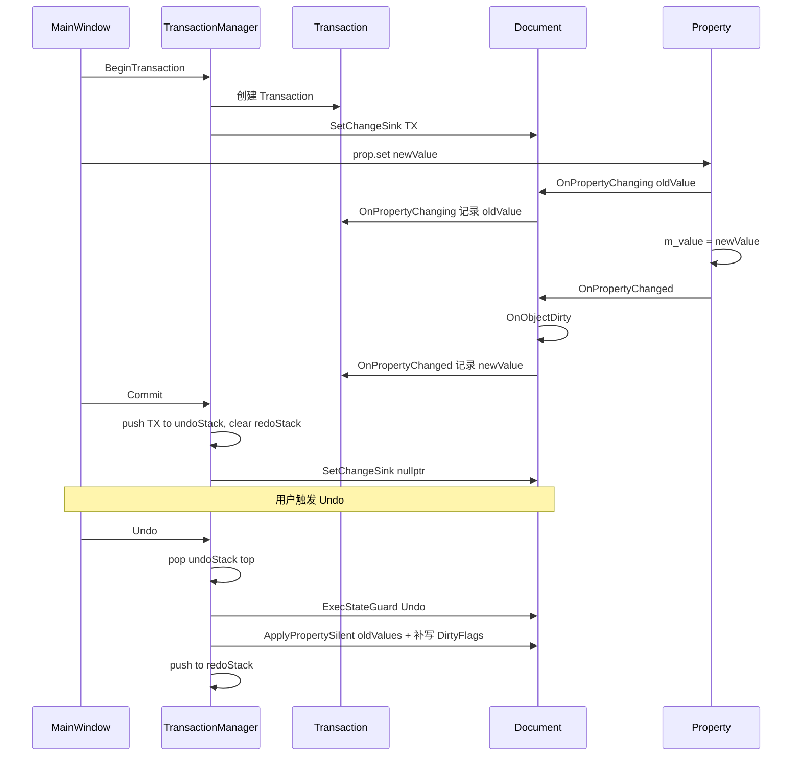
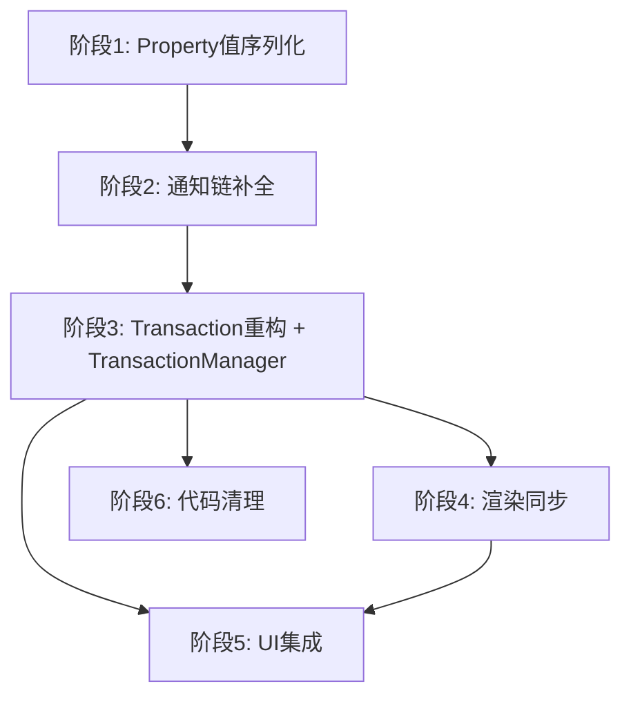

# CAD-Project-utils 事务系统开发方案（方案 B — TransactionManager）

## 一、现状问题总结

| # | 问题 | 所在文件 | 严重程度 |
|---|------|----------|----------|
| 1 | Undo/Redo 栈不存在，Transaction 是一次性的 | Document.h/cpp, Transaction.cpp | 🔴 核心缺失 |
| 2 | OnPropertyChanged 通知链断裂，newValue 未记录 | Document.cpp:129 | 🔴 |
| 3 | Property::Value() 返回空 AnyValue | Property.h:64 | 🔴 |
| 4 | AnyValue 不支持 Point3d 等复合类型 | NameDefine.h | 🟡 |
| 5 | ApplyPropertySilent 有死代码 | Document.cpp:89 | 🟢 |
| 6 | Undo/Redo 后不产生 Dirty 标记，渲染不更新 | Transaction.cpp RollBack | 🔴 |
| 7 | UI 层无 Undo/Redo 入口，属性编辑未包裹 Transaction | MainWindow.cpp | 🟡 |

## 二、架构设计

### 核心思路：引入独立 TransactionManager

将事务栈管理从 Document 中剥离，放到 Platform 层的 TransactionManager 类中。

### 调用流程

### 职责划分

| 类 | 职责 | 层 |
|----|------|-----|
| Document | 数据容器 + 脏标记 + 属性通知转发 | Data |
| Transaction | 纯数据记录类，记录 ChangeKey→ChangeRec | Platform |
| TransactionManager | 事务生命周期管理 + Undo/Redo 栈 + 执行回放 | Platform |
| MainWindow | 持有 TransactionManager，触发 Begin/Commit/Undo/Redo | Application |

## 三、开发任务分解

### 阶段 1：修复 Property 值序列化基础设施

**任务 1.1 — Point3d 的 AnyValue 支持**
- 文件：src/Common/Public/Point3d.h, src/Common/Public/NameDefine.h
- 为 Point3d 添加 ToString/FromString 方法
- AnyValue 添加 Point3d 构造和 Get 特化
- AnyValueSupported<Point3d> 特化为 true

**任务 1.2 — 修复 Property::Value()**
- 文件：src/Data/Public/Property.h
- 对 AnyValueSupported 的类型返回 AnyValue(m_value)，否则返回空

### 阶段 2：补全 OnPropertyChanged 通知链

**任务 2.1 — Document::OnPropertyChanged 转发 newValue**
- 文件：src/Data/Private/Document.cpp
- 在 OnPropertyChanged 中增加 m_changeSink->OnPropertyChanged 调用

### 阶段 3：重构 Transaction + 新建 TransactionManager

**任务 3.1 — Transaction 重构为纯数据记录类**
- 文件：src/Platform/Public/Transaction.h, src/Platform/Private/Transaction.cpp
- 移除构造函数中的 Document 操作（不再自动 SetCurrentTransaction）
- 移除析构函数中的 Document 操作
- 移除 Commit/RollBack 方法（这些逻辑移到 TransactionManager）
- 添加 GetChanges() 只读访问器
- 添加 IsEmpty() 判断

**任务 3.2 — 新建 TransactionManager**
- 新文件：src/Platform/Public/TransactionManager.h, src/Platform/Private/TransactionManager.cpp
- 成员：m_doc(weak_ptr), m_undoStack, m_redoStack, m_active
- BeginTransaction()：创建 Transaction，设为 Document 的 changeSink
- Commit()：将 active 入 undoStack，清空 redoStack，清空 Document changeSink
- RollBack()：恢复 active 中的 oldValues，丢弃 active
- Undo()：弹出 undoStack 顶，ExecState::Undo 下遍历 ApplyPropertySilent(oldValue)，补写 dirty，入 redoStack
- Redo()：弹出 redoStack 顶，ExecState::Redo 下遍历 ApplyPropertySilent(newValue)，补写 dirty，入 undoStack
- CanUndo()/CanRedo()

**任务 3.3 — Document 接口适配**
- 文件：src/Data/Public/Document.h, src/Data/Private/Document.cpp
- 将 m_transaction 重命名为 m_changeSink（语义更清晰）
- SetCurrentTransaction 改为 SetChangeSink
- 移除 Document::Undo/Redo 方法（或保留为空壳委托给外部）
- ExecStateGuard 改为 public（TransactionManager 需要使用）
- 删除 Document.cpp:89 的死代码

### 阶段 4：Undo/Redo 后的渲染同步

**任务 4.1 — Undo/Redo 补写 DirtyFlags**
- 在 TransactionManager::Undo/Redo 中，每次 ApplyPropertySilent 后通过 TypeMeta 查找属性的 DirtyFlags，调用 Document::OnObjectDirty

### 阶段 5：UI 层集成

**任务 5.1 — MainWindow 持有 TransactionManager**
- 文件：src/Application/UI/MainWindow.h, src/Application/UI/MainWindow.cpp
- 构造时创建 TransactionManager

**任务 5.2 — OnPropItemChanged 包裹事务**
- 属性编辑时 BeginTransaction → 修改 → Commit

**任务 5.3 — 添加 Undo/Redo 快捷键和菜单**
- QAction Ctrl+Z / Ctrl+Y
- slot 中调用 TransactionManager::Undo/Redo + RenderSystem 刷新 + 属性面板刷新

### 阶段 6：代码清理

**任务 6.1** — 更新 CMakeLists.txt（Platform 模块新增 TransactionManager 源文件）
**任务 6.2** — 更新 AI_CONTEXT.md

## 四、依赖关系

## 五、涉及文件清单

| 文件 | 改动类型 |
|------|----------|
| src/Common/Public/NameDefine.h | 修改 — AnyValue 增加 Point3d 支持 |
| src/Common/Public/Point3d.h | 修改 — 添加 ToString/FromString |
| src/Data/Public/Property.h | 修改 — Value() 实现 |
| src/Data/Private/Document.cpp | 修改 — OnPropertyChanged 补全、移除 Undo/Redo、重命名接口 |
| src/Data/Public/Document.h | 修改 — m_changeSink、ExecStateGuard public、移除 Undo/Redo |
| src/Platform/Public/Transaction.h | 修改 — 精简为纯数据记录类 |
| src/Platform/Private/Transaction.cpp | 修改 — 移除 Document 操作逻辑 |
| src/Platform/Public/TransactionManager.h | 新建 |
| src/Platform/Private/TransactionManager.cpp | 新建 |
| src/Platform/CMakeLists.txt | 修改 — 添加新源文件 |
| src/Application/UI/MainWindow.h | 修改 — 添加 TransactionManager、Undo/Redo action |
| src/Application/UI/MainWindow.cpp | 修改 — 事务包裹、Undo/Redo slot |
| AI_CONTEXT.md | 修改 — 更新架构文档 |